# CNN의 이해
동물의 시각 피질에 구조에서 영감을 받다 만들어진 딥러닝 신경망 모델

시각 자극이 1차 시각피질, 2차 시각피질, 3차 시각피질을 통과하여 계층적 정보처리 

CNN은
전반부 : 컨볼루션 연산을 통해 특징을 추출함  (컨볼루션)
차원을 감소시키며, 적은 영역으로 쪼개어 쪼개진 부분이 어떤 특징을 가졌는지 추출함

후반부 : 특징을 통한 분류 진행  (다층 퍼셉트론)
감소되 차원을 다시 합치는 과정을 통해 분류된 특징을 분류함

영상분류, 문자인식 등, 인식문제에 높은 성능을 가짐

ex)

아래의 예제를 기준으로 가장 우측의 필터를 적용하여 세로선과 가로선을 찾는 예제이다. 
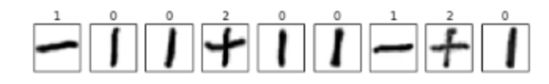

아래는 세로선 필터를 사용하여 세로선의 특징만을 추츨한 모습이다.
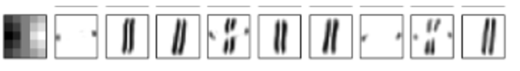

아래는 가로선 필터를 사용하여 가로선의 특징만을 추츨한 모습이다.
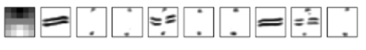

## 지역 수용 필드
위에서 CNN의 전반부는 컨볼루션 연산을 통하여 특징을 추출하고, 차원을 감소 시킨다고 하였다. 
다음의 간단한 예시를 통하여 알아보자.  
우선 그 전에 지역 수용 필드가 무엇인지에 대해 알아보자 :  
지역 수용 필드란, 2차원 이미지에서 특정 부분을 추출하여 다음 계층의 뉴런과 연결하는 역할을 하는 영역을 의미한다. 즉, 이미지의 작은 부분을 행렬 형태로 자른 후, 이를 다음 계층의 하나의 은닉 뉴런과 연결하는데, 이때 이 연결된 작은 영역을 '지역 수용 필드'라고 한다.

 
이 이미지는 $5\times5$ 크기의 2차원 행렬이며, 이를 입력 데이터로써 사용할 것 입니다. 

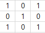 
이 이미지는 $3\times3$ 크기의 필터입니다. 이 필터는 컨볼루션 연산을 진행할 때, 입력 이미지의 각 부분에 적용되며, 각 영역에서의 값을 계산하게 될 것입니다. 
컨볼루션 계산에는 다양한 연산이 존재하며, 이 예제에서는 겹친 부분이 1인 갯수로 진행됩니다. 

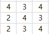 
이 이미지는 결과 이미지이며, 위의 입력 이미지에 컨볼루션 연산을 진행 했을시 반환되는 데이터 입니다. 

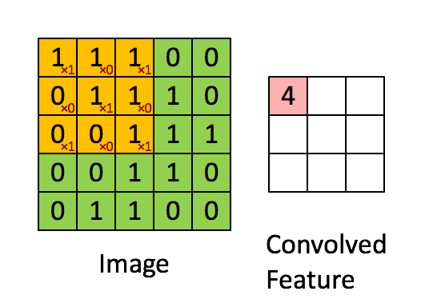 
이 gif는 이를 이해하기 쉽도록 도와줄 것입니다. 추후 나오겠지만 필터가 1칸이 이동을 하는 것을 보입니다. 이를 스트라이더라고 하며, 현제 1칸씩 이동하기 때문에 스트라이더는 1라고 할 수 있습니다. 

## 필터들의 예시
커널(필터)을 통해 추출한 이미지의 특징을 활성화 맵이라고 합니다. 
CNN 이전에는 filter bank에 커널을 저장하여 사용하였습니다. 다음은 몇가지 필터의 예시입니다.

ex)
edge detection kernel : 선만 추출 
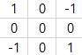  
sharpen kernel : 특징 강화 
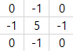  
box blur kernel : 전체적으로 블러처리 
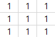  

이와 같은 필터를 사용하여, 색의 대비, 가로선, 세로선, 대각선등의 특징을 통해 물체의 모양을 유추하고, 이를 통하여 분류를 진행합니다. 
그렇다면, 왜 활성화 맵을 만들어 특징을 추출할까요? 
그 이유는 원본 이미지를 학습하는 것 보다 특징을 추출하여, 저차원에서 비교하는 편이 더 쉽기 때문입니다.  

## 폴링
풀링에는 최댓값, 최소값, 평균값 폴링이 존재합니다. 
폴링을 사용하는 이유는 두 가지 존재합니다

- 차원의 축소로 연산량 감소
- 이미지의 강한 특징만을 추출

ex)
모서리 추출에서 max 풀링 연산시 모서리에 대한 특징만 강하게 남을 것임+ 차원 축소

컨볼루션이 진행된 후에는 항상 폴링이 번갈아 동작해야 한다.

## 수식
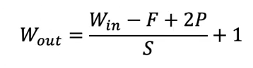 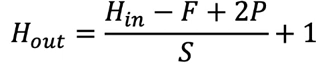 
F는 필터의 크기, P는 패딩의 크기, S는 스트라이드를 의미합니다 
스트라이드는 위에서 언급하였듯, 컨볼루션 연산시 건너뛰는 정도를 의미합니다. 
스트라이드가 클시 이미지를 확 넘어가면 차원이 많이 축소됩어 연산 시간이 감소합니다. 하지만 그 만큼 특징을 많이 추출하지 못한다는 단점이 있습니다.  
패딩은 나머지 연산을 진행 했을때, 차원이 정수로 나누어 떨어지지 않을 수 있는데, 이때, 이미지의 외각에 P만큼 0을 채워주는 zero-padding을 적용합니다  
수식에서 P에 2를 곱하여 주었는데, 이는 패딩이 (상, 하), (좌, 우) 두 번씩 적용되기에 2를 곱하여 준 것입니다.  
W는 입/출력 이미지의 너비, H는 입/출력 이미지의 높이를 의미하고, K는 사용한 필터의 갯수를 의미합니다. 더 많은 필터를 사용할수록 더 많은 특징을 잡아낼 것입니다.
  
ex)
$28*28*1$의 mnist이미지에 $4*4$ 크기의 필터에 스트라이드가 2이고, 제로 패딩을 1회 적용, 필터의 갯수가 64개라면 
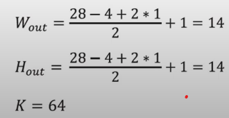 

$14*14$ 크기의 64개의 활성화 맵이 추출될 것임을 알 수 있습니다.

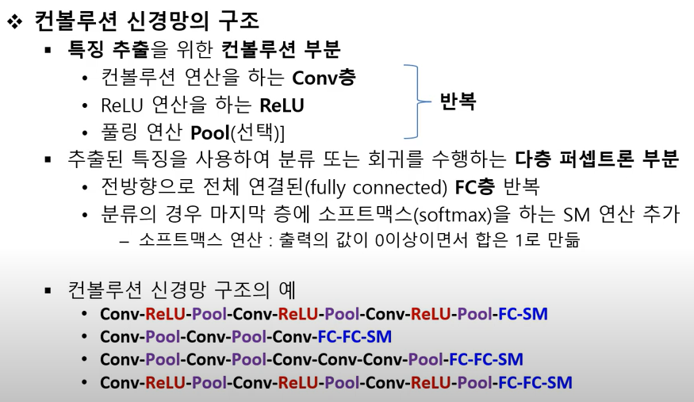

## 참고할 만한 레퍼런스
https://www.youtube.com/watch?v=G0kzSRbNF6E

## 조사할 예정
VGGNET

ResNet

GoogleNet(inception)

SSD(Single Shot Multibox Detector)

YOLO(you Only Look Once)

Faster R-CNN

Mask R-CNN